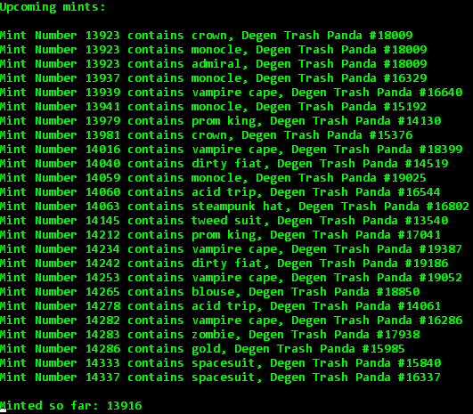

# Degen Trash Panda - Mint Scraper (only works for WINDOWS)

## YOU NEED TO ADD 12,000 TO THE CURRENT MINT NUMBER because the token holder transferred 12k tokens away from the wallet I am counting it from (https://solscan.io/account/CheWJgRCqpEXiEGVdh4HHiQdprtrzrVjgXazuCfCFM1P#splTransfer)

**IMPORTANT install this (run your command line as administrator, https://docs.solana.com/cli/install-solana-cli-tools) and make sure that in the command line the commands "solana" and "curl" work**

Download link: https://drive.google.com/file/d/10nbnvjVwRr6j4h84_TTFgPSfihfGy4wT/view?usp=sharing

This will allow you to see the current mint number + the upcoming rares/mythics. Go and grab something nice! 
Unzip the file and run start.bat. Scrape.java contains the source code. Make sure to start the program shortly before the mints start because Pit likes to reshuffle the order.

__Solana wallet for donations__: 5zPhWGKHAwyZBf1fqxYCWahqwV29XVsMB3RwELYNp3uR

Feel free to drop some shit in this wallet.

